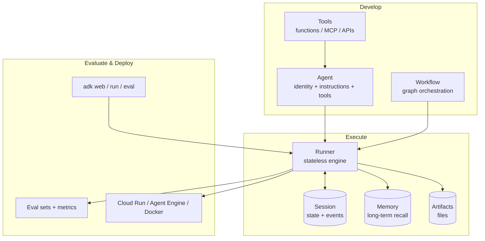
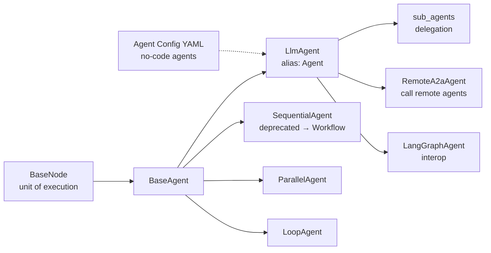
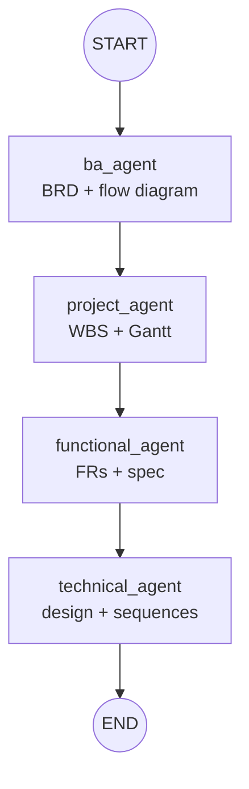
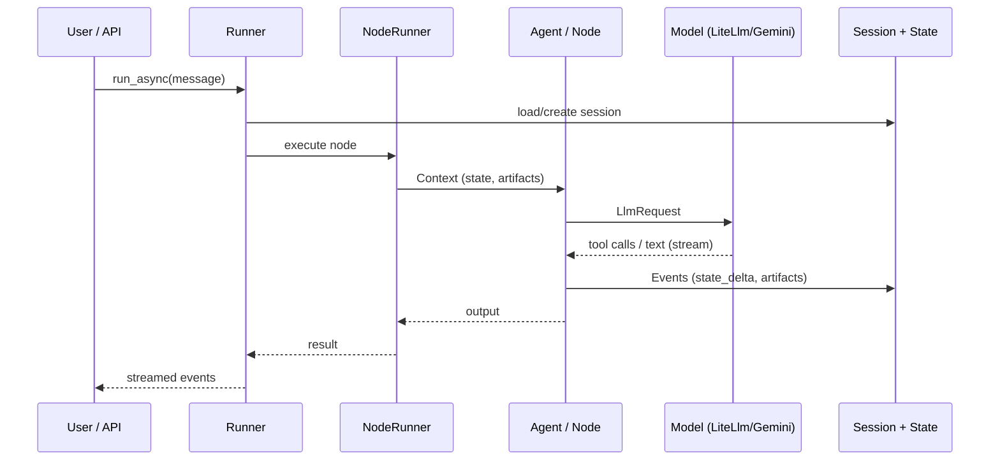
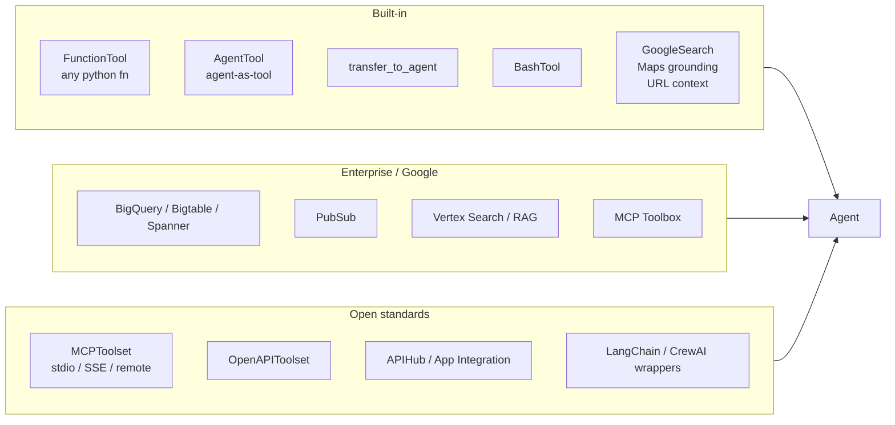
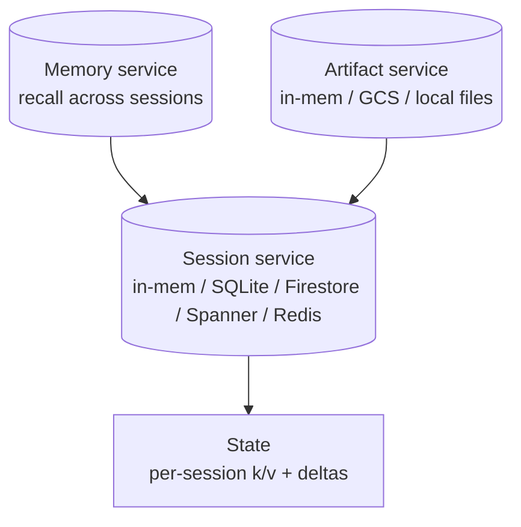
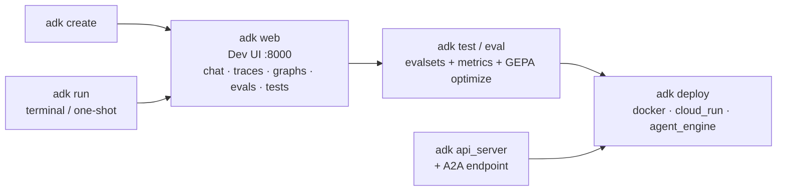

# ADK Python — Feature Catalog (`google/adk`, v2.9.0)

> Source: [`google/adk-python`](https://github.com/google/adk-python) (cloned 2026-09-17).
> Code-first Python framework for building, evaluating, and deploying AI agents.
> Model-agnostic (Gemini-optimized), deployment-agnostic. Python 3.10+.
> Diagrams below are Mermaid — they render directly on GitHub.

## 1. Big picture



**Diagram says:** you build agents out of 3 boxes (Agent, Workflow, Tools). A Runner runs them — it remembers chat in Sessions, old facts in Memory, files in Artifacts. Then you test and ship to the cloud. Simple: make → run → launch.

| Layer | Components | What you get |
|---|---|---|
| Build | `Agent`, `Workflow`, `BaseNode`, Tools | Compose single agents and multi-agent graphs in pure Python (or no-code YAML config) |
| Execute | `Runner`, `NodeRunner`, `Context`, `Event` | Stateless runs, streaming, retries, checkpoint/resume, human-in-the-loop |
| Remember | Sessions, Memory, Artifacts | Per-user state, cross-session recall, file attachments |
| Ship | CLI, Dev UI, Eval, Deployers | Test locally, score quality, deploy to Cloud Run / Vertex Agent Engine |

## 2. Agent types



**Diagram says:** everything starts from one small brick (BaseNode). From it you get ready-made workers: the normal smart agent, teams where agents hand work to each other, chains, parallel runners, repeaters, callers of far-away agents, and even agents with zero code (YAML file only).

| Agent | Use for |
|---|---|
| `Agent` (`LlmAgent`) | General LLM agent: instructions + model + tools + callbacks + planners |
| `SequentialAgent` / `ParallelAgent` / `LoopAgent` | Ordered / fan-out / repeating sub-agent patterns (legacy; prefer `Workflow`) |
| `RemoteA2aAgent` | Delegate to agents served over the A2A protocol |
| `LangGraphAgent` | Embed existing LangGraph graphs |
| Config agents (`root_agent.yaml`) | No-code agents via YAML + code references |

## 3. Workflow runtime (ADK 2.0)

Graph engine: routing, fan-out/fan-in, loops, retry, dynamic nodes, nested
workflows, per-node streaming, interrupts (HITL), resumability.



**Diagram says:** work flows like an assembly line — BA writes requirements, hands them to Project (planning), then Functional (details), then Technical (build design). Each station passes its output to the next, start to finish.

```python
from google.adk import Agent, Workflow

root_agent = Workflow(
    name="delivery_pipeline",
    edges=[("START", ba_agent, project_agent, functional_agent, technical_agent)],
)
```

Concepts: `BaseNode` (contract) · `Context`/`ctx.run_node()` (parent channel) ·
`Event` (session/streaming channel) · `NodeRunner` (one node) · `Runner`
(invocation + session) · branch paths (`parent.child@1`) · checkpoint/resume.

## 4. Invocation lifecycle



**Diagram says:** when you send one message, it travels a fixed route — Runner opens your chat file, wakes up the worker, worker asks the AI brain (which may use tools), everything gets written back to your chat file, and the answer streams to you word by word.

Features on this path: streaming (SSE), tool confirmation/HITL pauses,
`long_running_tool_ids` resume, retries/timeouts, OpenTelemetry spans per node.

## 5. Tool ecosystem



**Diagram says:** tools are the agent's hands, in 3 boxes — ready-made ones (your own Python functions, Google search, terminal), company-grade ones (Google databases, search, queues), and universal plugs (MCP, any REST API, LangChain/CrewAI tools). All plug into the same agent.

Plus: authenticated tools + credential service, long-running tools,
`require_confirmation` HITL guard, custom `BaseTool`/`BaseToolset`,
code executors (local / container / Vertex / E2B / Daytona Cardinal).

## 6. Models (model-agnostic)

| Path | Models |
|---|---|
| `GoogleLLM` (native) | Gemini family, tuned path, context caching |
| `LiteLlm` | 100+ via LiteLLM: OpenAI, Anthropic, Ollama, any OpenAI-compatible endpoint (e.g. Meta `muse-spark` at custom `api_base`) |
| `AnthropicLlM`, `GemmaLlm` | Direct provider paths |
| Extras | Fallback chains, prompt cache, output-schema + tools reconciliation |

**In short:** not locked to Google — plug in OpenAI, Anthropic, local Ollama, or your own server, with automatic backup if one fails.

```python
from google.adk.models.lite_llm import LiteLlm
model = LiteLlm(
    model="openai/muse-spark-1.3-contributor",
    api_base="https://api.meta.ai/v1",
    api_key="...",
)
```

## 7. State: sessions, memory, artifacts



**Diagram says:** three memory boxes feed your agent — Session (what's happening in this chat), Memory (what it learned about you in past chats), Artifacts (files like docs and diagrams). All can live on your laptop or in Google databases.

* **Sessions** persist the event log + state; tools mutate `tool_context.state`.
* **Memory** (`preload_memory_tool`, `load_memory_tool`) gives long-term recall.
* **Artifacts** store files per session (docs, diagrams, HTML viewers).

## 8. CLI, Dev UI, evaluation, deploy



**Diagram says:** the road from idea to live product — scaffold it, open the visual playground to chat and debug, auto-grade its answers, then ship it to Docker or Google Cloud with one command. A server mode exists for apps and agent-to-agent calls.

* `adk web` serves the prebuilt Dev UI (`cli/browser/`) + FastAPI (`/list-apps`, `/run`, dev-only `/dev/...` eval/debug/graph endpoints). Local-dev only (unauthenticated).
* **Eval:** eval sets, custom metrics, user simulators, `adk optimize` (GEPA prompt optimization).
* **Deploy:** Docker, Cloud Run (`--with_ui` supported), Vertex AI Agent Engine, A2A.
* **Observability:** OpenTelemetry tracing/metrics, BigQuery analytics plugin, ModelArmor, Cloud Trace/Logging exporters.

## 9. Auth, safety, extensions

* Auth: API-key/OAuth/OIDC credential service, `request_credential` flow, GCP (Secret Manager, Parameter Manager, IAM) integrations.
* Safety: tool confirmation HITL, ModelArmor plugin, redaction helpers.
* Live/multimodal: bidirectional streaming (`live/`), transcription, LiveKit + Speech/TTS integrations.
* Messaging: Slack runner (Socket mode), Eventarc triggers, PubSub tools.
* Community: `google-adk-community` + samples (`contributing/samples/`: multi-agent, workflows, HITL, eval, RAG, live).

**In short:** logins handled safely, dangerous actions ask a human first, plus voice/video, Slack bots, and ready-made community examples.

## 10. Minimal example

```python
from google.adk import Agent

root_agent = Agent(
    name="greeting_agent",
    model="gemini-2.5-flash",
    instruction="You are a helpful assistant. Greet the user warmly.",
)
```

```bash
pip install google-adk
adk web path/to/agents_dir   # http://127.0.0.1:8000
```

**In short:** 5 lines of Python = a working agent; 2 commands = chat with it in your browser.
